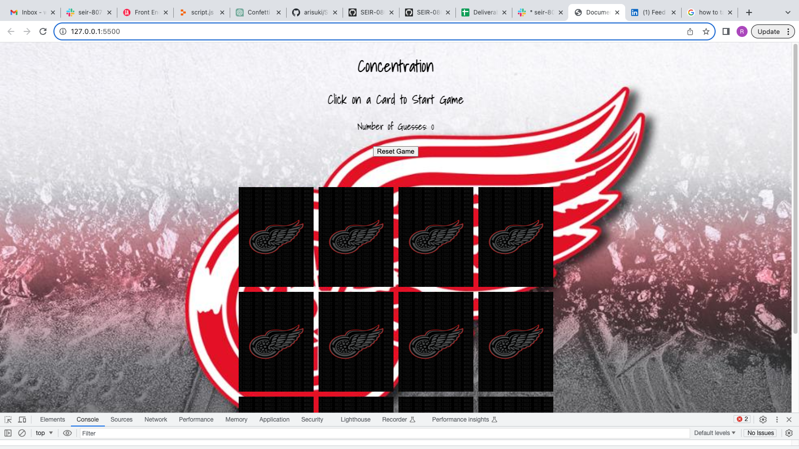
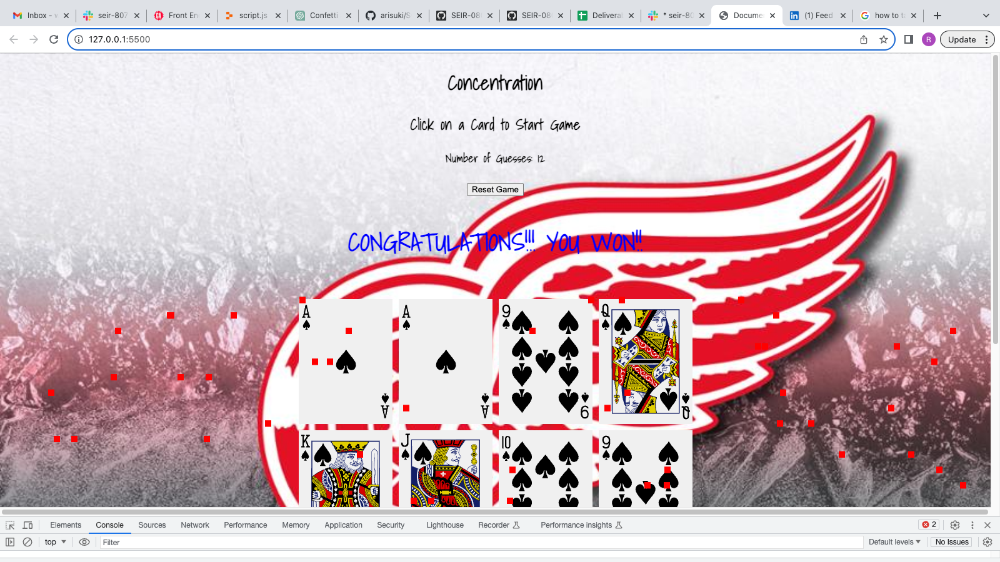
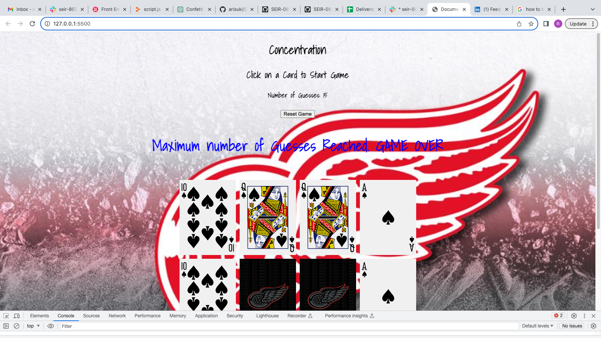

Detroit Red WIngs Themed Concentration (Memory Game)

## Screenshots

Start of Game

Winning!!

Losing

## Technologies used

    - JavaScript
    - HTML
    - CSS

## Getting Started

[Concentration](https://rjwyse.github.io/Project1-Concentration/)

The game starts with all the cards face down a player turns over two cards. If the two cards have the same picture, then the cars stay flipped over, otherwise they turn the cards face down again. You win if you can get all the cards matched in under 15 tries.

## Next Steps

    - I want to have more cards
    - I want to have a time limit to pick cards
    - I want to be able to have it be a 2 player game option
    - I would like to add sound

## Think about the  overall design (look & feel) of the app

- Array of grid of cards

## Screenshots
### Initial State

As a user
- I want to be able to have 1 player.
- I want to have the player be able to flip 2 cards
- I want to be able to keep cards flipped if correctly matched
- I want to know if you win or lose
- I want to be able to play the game again if it's over
- I want a max number of guesses

## Pseudocode

- Game Board
    - create an 4x3 grid
    - Create an array called "matchingCards" to hold 6 different matching cards
    

- The Cards
    - create an array with pairs of cards ace of spades, king of spades, queen of    spades, jack of spades, ten of spades, 9 of spades.
    - shuffle the cards randomly upon hitting start game

- Populating the Game Board
    - For each row and column
        - pick a card from the suffled cards

- Playing The Game
    - Display the Game
    - Prompt player to select 2 cards
    - If the 2 cards the player selects match reveal cards
    - If the 2 cards players selects do not match flip back over (hide)
    - Give max amount of turns of 15
    - if players geta all matched in under 15 turns player wins
    - if player uses all 15 turns and can not match all cards player loses

- After Game
    - after player wins or runs out of guesses have "play again" button pop up

