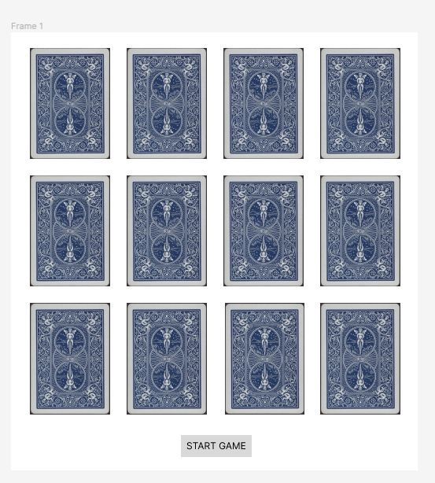

Concentration (Memory Game)

As a user
- I want to be able to have 1 player.
- I want to be able to take turns
- I want to have each player to be able to flip 2 cards
- I want to be able to keep cards flipped if correctly matched
- I want to know who won or if it was a tie
- I want to be able to play the game again if it's over
- I want a max number of guesses
- I want to have a time limit to pick cards

## Think about the  overall design (look & feel) of the app

- Array of grid of cards

## Screenshots
### Initial State

## Pseudocode

- Game Board
    - create an 4x3 grid
    - Create an array called "matchingCards" to hold 6 different matching cards
    

- The Cards
    - create an array with pairs of cards ace of spades, king of spades, queen of    spades, jack of spades, ten of spades, 9 of spades.
    - shuffle the cards randomly upon hitting start game

- Populating the Game Board
    - For each row and column
        - pick a card from the suffled cards

- Playing The Game
    - Display the Game
    - Prompt player to select 2 cards
    - If the 2 cards the player selects match reveal cards
    - If the 2 cards players selects do not match flip back over (hide)
    - Give max amount of turns of 15
    - if players geta all matched in under 15 turns player wins
    - if player uses all 15 turns and can not match all cards player loses

- After Game
    - after player wins or runs out of guesses have "play again" button pop up

